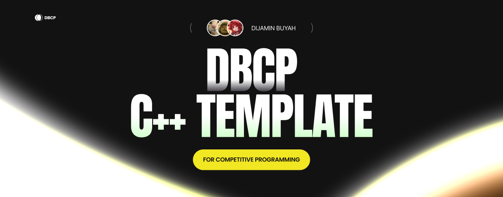

<div align="center">

[](https://github.com/your-repo/dbcp)

# DBCP

<!-- [𝙶𝚒𝚝𝙷𝚞𝚋](https://github.com/your-repo/dbcp) ✦ [𝙷𝚘𝚠 𝚝𝚘 𝙸𝚗𝚜𝚝𝚊𝚕𝚕](#how-to-install) ✦ [𝙲𝚘𝚗𝚝𝚛𝚒𝚋𝚞𝚝𝚘𝚛𝚜](#contributors) ✦ [𝙳𝚘𝚗𝚊𝚝𝚎](#support-the-development-by-donating) -->

**Streamline your competitive programming workflow.** This C++ template is designed to supercharge your coding speed in CP contests with pre-built macros, debugging tools, and optimized I/O utilities. Focus on solving problems, not boilerplate code.

</div>

<br>

<div align="center">


</div>

## Getting Started with the CP Template

This Competitive Programming (CP) C++ template (`dbcp.cpp`) is designed to streamline coding for CP contests by including useful macros, debugging tools, and input/output utilities. It’s built to help you focus on problem-solving with minimal setup time.

We're working on actively improving the template. Stay updated by starring the repo.

---


- **Optimized I/O**: Fast input/output with `ios_base::sync_with_stdio(false)` and `cin.tie(NULL)`.
- **Powerful Macros**: Predefined loop, container, and modular arithmetic macros for rapid coding.
- **Debugging Suite**: Local debugging with variable inspection (`debug`), scope timing (`scope`), and input simulation (`Redirect`).
- **Modular Structure**: Cleanly organized with sections for aliases, macros, setup, and logic.
- **ATS-Friendly**: Structured to handle contest input/output formats efficiently.

---


> [!IMPORTANT]
>
> **Simplest** way to get this is by take a quick look at the dbcp.cpp or mdbcp.cpp (mini ver.), then you can download the raw file and use them as you like.

Or you can:
1. **Clone the Repository**:
   ```bash
   git clone https://github.com/shuretokki/dbcp.git
   ```
2. **Copy the Template**:
   - Copy `dbcp.cpp` to your working directory and rename it as needed (e.g., `solution.cpp`).
3. **Compile**:
   - Use a C++17 or later compiler (e.g., g++).
   - For debugging, compile with `-DLOCAL_DBG`:
     ```bash
     g++ -DLOCAL_DBG dbcp.cpp -o dbcp
     ```
   - For contests, compile without debug flag:
     ```bash
     g++ dbcp.cpp -o dbcp
     ```

The template uses:
- **C++**: Version 17 or later.
- **Standard Library**: `<bits/stdc++.h>` for comprehensive access.

| Technology | Info/Version |
| ---------- | ------------ |
| C++        | 17+          |

## Highlights

- **Efficient Setup**: Pre-configured I/O optimizations and macros for faster coding.
- **Debugging Tools**: Variable inspection and scope timing for local development.
- **Flexible I/O**: Custom functions for handling various data types efficiently.
- **Modular Design**: Organized sections for aliases, macros, setup, and logic.
- **Customizable**: Easily extend with new macros or utilities for specific contests.

## Feature List

### 1. Header and Namespace Setup
- Includes `<bits/stdc++.h>` for full C++ standard library access.
- Uses `std` namespace to avoid prefixing.
- Configures fast I/O with `ios_base::sync_with_stdio(false)` and `cin.tie(NULL)`.
- Includes GCC optimization pragmas for enhanced performance (`O3`, `unroll-loops`, `avx2`, etc.).

### 2. Type Aliases
- `vi`: `vector<int>`.
- `vvi`: `vector<vi>` (2D vector of integers).
- `ll`: `long long`.
- `vll`: `vector<long long>`.
- `ld`: `long double`.
- `str`: `string`.
- `strv`: `string_view`.
- `vb`: `vector<bool>`.
- `pii`: `pair<int, int>`.
- `vpii`: `vector<pair<int, int>>`.

### 3. Constants
- `MOD`: `1e9 + 7` for modular arithmetic.
- `PI`: `acos(-1.0)` for precise pi value.
- `INF`: Large integer constant for infinity comparisons.
- `LINF`: Large long long constant for infinity comparisons.

### 4. Macros
- **Loop Macros**:
  - `rep(i, n)`: Iterates from `i = 0` to `i < n`.
  - `rep1(i, n)`: Iterates from `i = 1` to `i <= n`.
  - `rev(i, n)`: Iterates from `i = n-1` to `i >= 0`.
  - `rev1(i, n)`: Iterates from `i = n` to `i > 0`.
- **Container Macros**:
  - `all(v)`: `v.begin(), v.end()`.
  - `rall(v)`: `v.rbegin(), v.rend()`.
  - `each(it, v)`: Iterates over container `v` with iterator `it`.
- **Utility Macros**:
  - `isOdd(x)`: Checks if `x` is odd.
  - `sz(v)`: Returns container size as an integer.
  - `add(a, b)`, `sub(a, b)`, `mul(a, b)`: Modular arithmetic operations.
  - `inv(n)`: Modular inverse of `n` under `MOD`.
<<<<<<< HEAD
  - `ceil_div(a, b)`: Ceiling of `a/b`.
  - `pb`: Alias for `push_back`.
  - `eb`: Alias for `emplace_back`.
  - `mp`: Alias for `make_pair`.
=======
  - `ceilDiv(a, b)`: Ceiling of `a/b`.
>>>>>>> 97653e24e9c839d8844d67763fe60240c4deed83
- **Priority Queue Aliases**:
  - `pqmax`: Max heap (`priority_queue<int>`).
  - `pqmin`: Min heap (`priority_queue<int, vector<int>, greater<int>>`).

### 5. Debugging Utilities
- **Conditional Debugging**: Enabled with `-DLOCAL_DBG`.
- **Redirect()**: Simulates input from a string (`Redirect(data)`).
- **scope()**: Tracks execution time of code blocks (`scope(name)`).
- **debug()**: Prints variable values (`debug(var1, var2, ...)`).
- **Rendering Functions**: Supports scalars, containers, pairs, tuples, etc.
- **Colorized Output**: Uses ANSI codes for readable debug output.

### 6. Input/Output Utilities
- **Reader**:
  - `input(...)`: Reads multiple variables of different types.
  - Handles integers, strings, characters, and iterables.
- **Writer**:
  - `output(...)`: Writes variables with space separation.
  - `outputln(...)`: Writes variables with a newline.
  - `delim(container, delimiter)`: Outputs container with custom delimiter.
  - Uses buffered output for performance.

### 7. Solution Section
- Place logic in a `Solution` section with a `solve()` method.
- Placeholder for contest-specific logic.

### 8. Main Function
- Includes `scope("Main")` for timing (in debug mode).
- Placeholder for input reading and solution execution.

## Usage Guide

### 1. Setup
- **File**: Rename `dbcp.cpp` to your solution file (e.g., `solution.cpp`).
- **Compiler**: Use g++ with C++17 or later.
- **Debug Mode**: Compile with `-DLOCAL_DBG` for debugging:
  ```bash
  g++ -DLOCAL_DBG solution.cpp -o solution
  ```
- **Contest Mode**: Usually in contest submission compiled without `-DLOCAL_DBG`, so you can keep all the `debug()`, `scope()`, or `Redirect()` used without needing to remove them.

### 2. Writing Solutions
- **Implement Logic**: Add code in `Solution::solve()`.
- **Input/Output**:
  - Use `input(var1, var2, ...)` to read input.
  - Use `output(var1, var2, ...)` or `outputln(var1, var2, ...)` to write output.
  - Use `delim(container, "delimiter")` for custom delimiter output.
- **Example**:
  ```cpp
  class Solution {
  public:
      int solve() {
          int n;
          input(n);
          vi a(n);
          input(a);
          int sum = 0;
          each(x, a) sum += x;
          outputln(sum);
          return sum;
      }
  };
  ```

### 3. **Debugging**
   - **Enable Debug Mode**: Compile with `-DLOCAL_DBG`.
   - **Test Input**: Use `Redirect` to simulate input:
     ```cpp
     Redirect("5 1 2 3 4 5");

     int maxV;
     input(maxV); // Take `5` from Redirect.

     vi v(maxV); // Vector<int> with `5` capacity.
     input(v); // Take `1 2 3 4 5` from Redirect.
     ```
   - Another Example:
     ```cpp
     Redirect("Hello World#Hello#World"); // Note that `#` can replace '/n' in this function

     string hw, h, w;
     input(hw, h, w); // hw take "Hello World", h take "Hello", w take "World"
     debug(hw, h, w); // [ DEBUG ] hw: "Hello World"...
     ```
   - **Trace Execution**: Wrap code blocks in `scope("block_name")` to measure execution time.
   - **Inspect Variables**: Use `debug(var1, var2, ...)` to print variable values.
   - **Example**:
     ```cpp
     scope("Processing");
     int x = 10, y = 20;
     debug(x, y); // Prints: [ DEBUG ] x: 10, y: 20
     debug("TESTING", x, y) // Prints: [ TESTING ] x: 10, y: 20
     ```

### 4. Common Patterns
- **Reading a Vector**:
  ```cpp
  int n;
  input(n);
  vi a(n);
  input(a);
  ```
- **Output with Custom Delimiter**:
  ```cpp
  vi a = {1, 2, 3};
  outputln(delim(a, ", ")); // Prints: 1, 2, 3
  ```
- **Modular Arithmetic**:
  ```cpp
  int a = 5, b = 3;
  outputln(add(a, b)); // Modular addition
  outputln(mul(a, b)); // Modular multiplication
  ```

### 5. Customizing the Template
- **Add Macros**: Extend `#pragma macro` section.
- **Add Aliases**: Add to `#pragma alias` section.
- **Modify I/O**: Customize `Reader` or `Writer` for contest formats.

### 6. Best Practices
- **Test Locally**: Use `Redirect` and `debug` to verify logic.
- **Keep it Clean**: Use `Solution` class to separate contest logic.
- **Check Constraints**: Handle edge cases (e.g., large inputs, negative numbers).

## Example Usage
Solve a problem that reads an array and outputs its sum:

```cpp
class Solution {
public:
    int solve() {
        scope("Solve");
        int n;
        input(n);
        vi a(n);
        input(a);
        debug("Array", a); // Debug: prints array content
        int sum = 0;
        each(x, a) sum += x;
        outputln(sum);
        return sum;
    }
};

int main() {
    scope("Main");
    Solution s;
    Redirect("5 1 2 3 4 5"); // Debug input
    s.solve();
    return 0;
}
```

**Output (with `-DLOCAL_DBG`)**:
```
[ > Main ]
  [ > Solve ]
  [ DEBUG ] Array: {1,2,3,4,5}
15
  [ < Solve ] @ 0ms taken
[ < Main ] @ 0ms taken
```

**Output (without `-DLOCAL_DBG`)**:
```
15
```

## Notes
- The template is optimized for speed and flexibility but may need tweaks for specific contest platforms.
- Verify contest I/O requirements before using `input`/`output` functions.
- Debugging utilities are disabled in contest mode to avoid errors or extra output.
